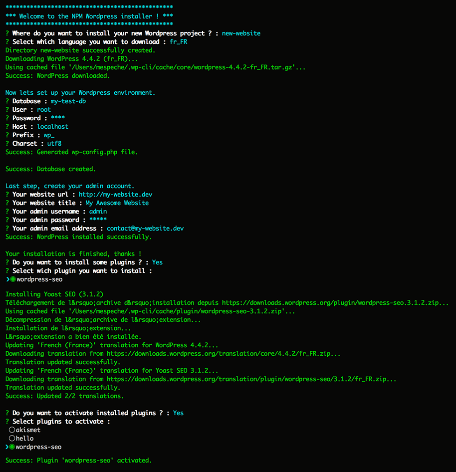

# NpmWordpressInstaller

NpmWordpressInstaller is a simple Wordpress installer using nodejs & npm.

## Purpose
* Download Wordpress (with locale choice)
* Generate wp-config.php file
* Create database
* Install clean Wordpress
* Create admin account

## How to use it ?
NpmWordpressInstaller require nodejs & npm.
After installing these dependencies, clone the project to your directory and open a terminal.

Next, do a `npm install` followed by `node wp-install`.

Enjoy ;-) !
